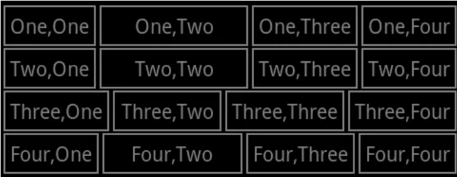
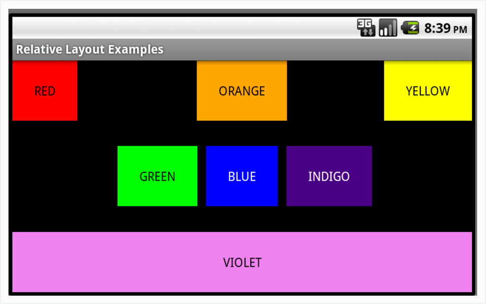
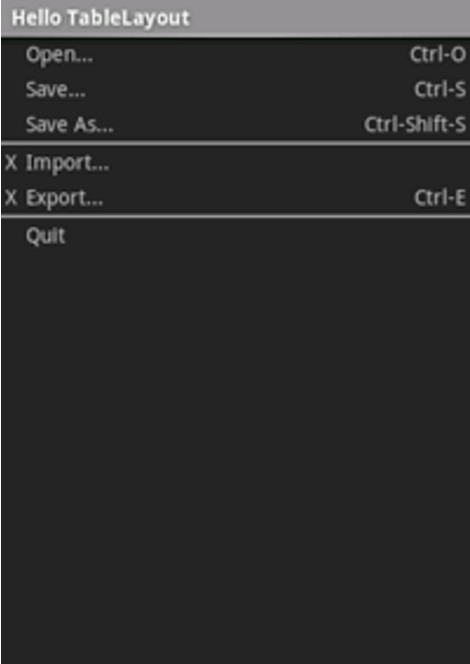

# 实验一――Android布局实验
## 实验内容
### 实验一 利用线性布局实现如下界面：

### 实验二 利用线性布局实现如下界面：

### 实验三 利用线性布局实现如下界面：

## 实验结果截图

##### 总结：
* 全文结束，感谢阅读，如有不妥，欢迎指出~

## 关于作者
* 软工一班李明
* 邮件(13799671597@163.com)
* weibo: [@潮�QML](http://weibo.com/u/5671356526)