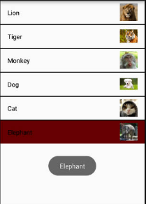
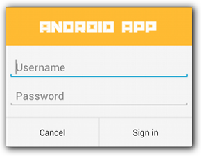
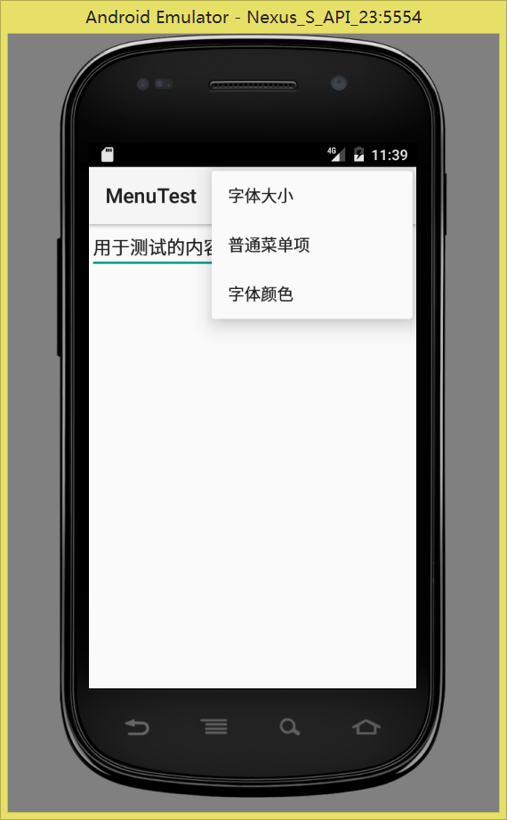

# 实验二――Android UI组件

## 实验内容
### 实验一 利用SimpleAdapter实现如下界面效果
* 注意列表项的布局
* 图片使用QQ群附件资源
* 使用Toast显示选中的列表项信息

### 实验二 创建如图所示的自定义对话框
* 请创建一个如图所示的布局，
* 调用 AlertDialog.Builder 对象上的 setView() 将布局添加到 AlertDialog。

### 实验三 使用XML定义菜单
* 字体大小（有小，中，大这3个选项；分别对应10号字，16号字和20号字）；点击之后设置测试文本的字体
* 普通菜单项，点击之后弹出Toast提示
* 字体颜色（有红色和黑色这2个选项），点击之后设置测试文本的字体

## 实验结果截图

##### 总结：
* 全文结束，感谢阅读，如有不妥，欢迎指出~

## 关于作者
* 软工一班李明
* 邮件(13799671597@163.com)
* weibo: [@潮�QML](http://weibo.com/u/5671356526)